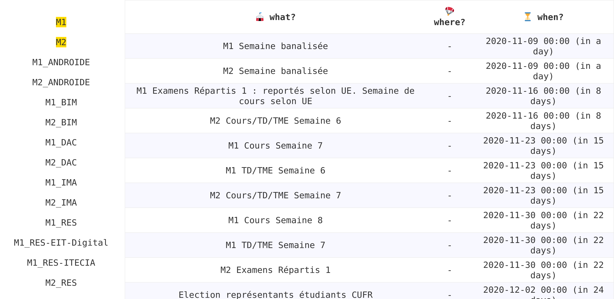

# new (i.e. better) web calendar @ cal.sorbonne.su 📅

alternative to: https://cal.ufr-info-p6.jussieu.fr/master/

upgrade of: https://cal.louis.ga/M1+M2 ([source available on Github](https://github.com/lgvld/cal))

## why?

the original web calendar takes ~25s to load (for a ~4mb total page size!! and caching is disabled!!) thus is unusable on mobile (let’s not talk about the shitty UI..).
also selection (of masters) is not saved (& wtf: default selection, why?!?).

see the GTmetrix reports:
- for [the original web calendar](https://github.com/lgvld/cal/blob/master/misc/GTmetrix-report-cal.ufr-info-p6.jussieu.fr-20200129T010855-wCBGfD5N.pdf)
- for [this new version](https://github.com/lgvld/cal.sorbonne.su/blob/master/misc/GTmetrix-report-cal.sorbonne.su-20201107T065255-i7xscPym.pdf) <3 <3 <3

## example

visit https://cal.sorbonne.su/M1+M2

## features

- you can set your own masters selection by concatening masters names (with a `+` symbol in between).
- on mobile, you can reload the events list simply by swiping bottom (thanks to [PulltoRefresh.js](https://github.com/BoxFactura/pulltorefresh.js)).
- you can hide menu by appening the anchor `#hide-menu` to the URL ([demo](https://cal.sorbonne.su/M2_IMA#hide-menu)).

## to do

- add a button to toggle/untoggle menu.
- refresh events on toggle (adding a master to selection).
- ...

## might be seful later

[39 CSS Calendars](https://freefrontend.com/css-calendars/)

;-)

